# TP-Elastic securité

<h4>I - Mise en place d'un environnement Elastic Security</h4>

Clone du dossier:

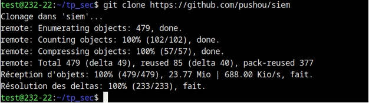

Modifs sur /etc/systcl.conf:

Lancement: https://10.202.13.1:5601

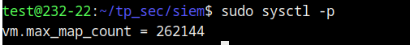

Pour pouvoir me connecter j’ai passé la commande “make pass”:

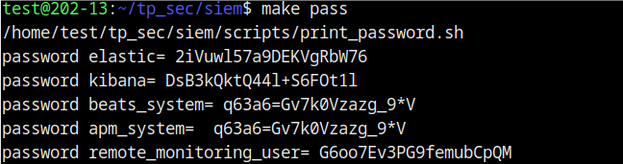

<h4>2. Conguration de fleet</h4>

<h4>2.1. Conguration de l'url de fleet</h4>

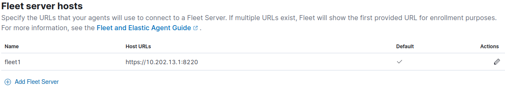

<h4>2.2 Conguration des "outputs" de fleets</h4>

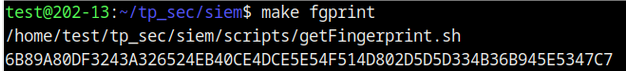

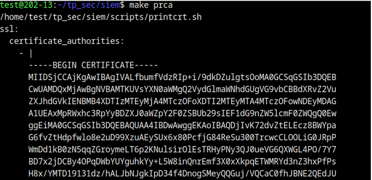

Creation d’output:

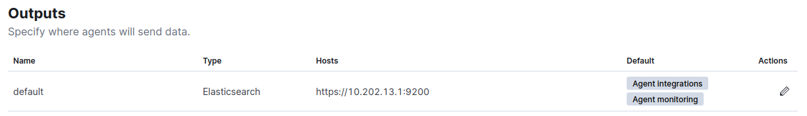

<h4>3 Agent Elastic sur un poste Windows</h4>

<h4>3.1 Installation de l'agent Elastic sur un poste Windows</h4>

Machine Windows: 

J'ai lancé la commande suivante pour installer l'agent sur une machine windows:

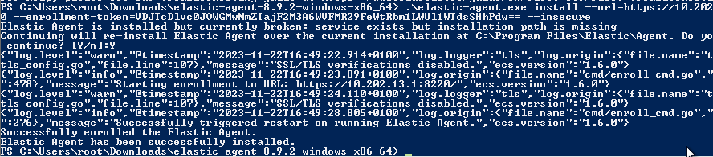

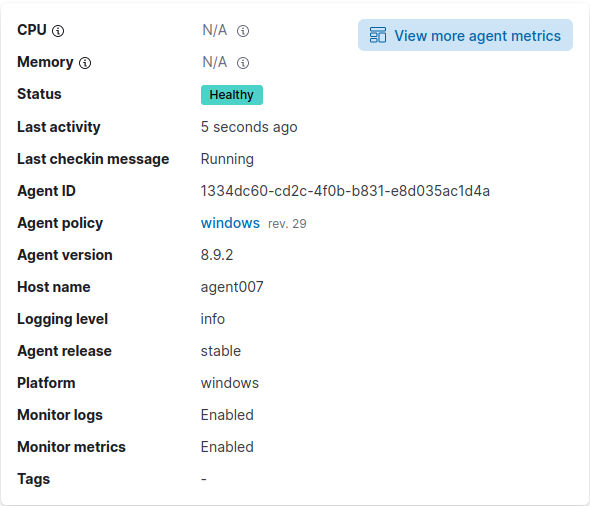

<h4>3.2 Déploiement des intégrations pour Windows</h4>

<image src="images/11.png"/>

Bon le reste Monsieur, vous savez que ça n'a pas marché pour Windows, j'ai avancé pour l'agent Linux

<h4>4. Agent Elastic sur un poste Linux</h4>

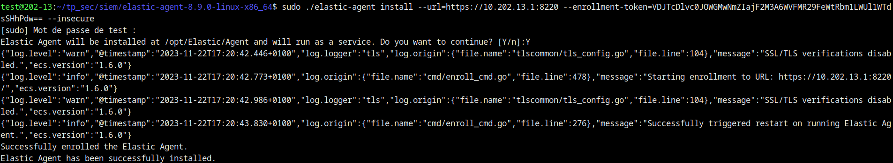

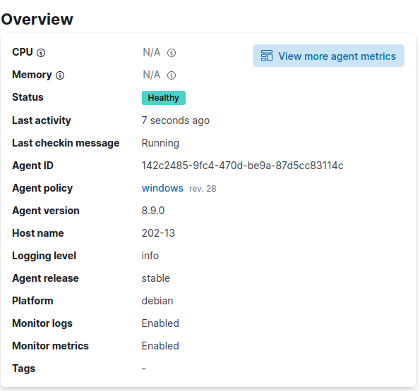

